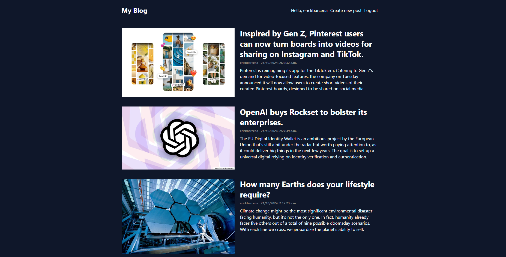
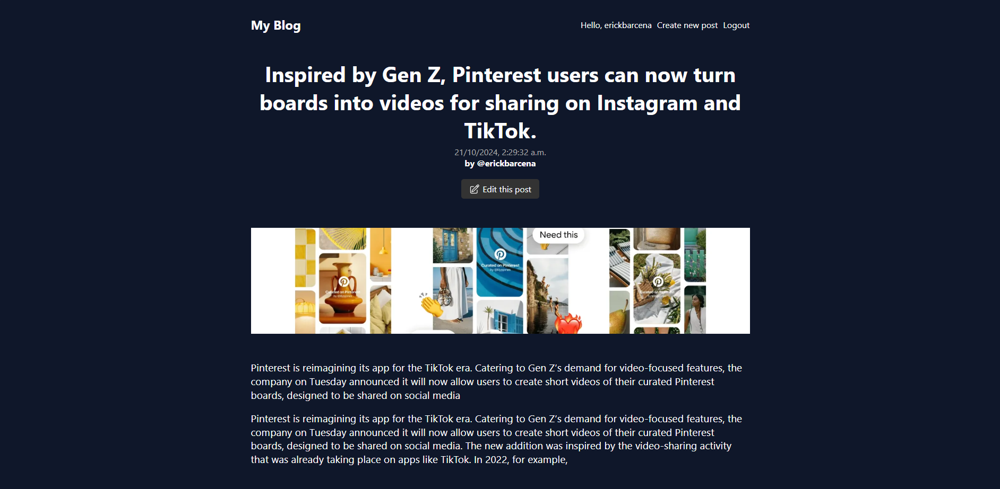
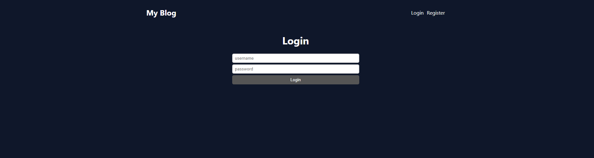

# MERN Stack Blog

This is a blog application built using the MERN (MongoDB, Express.js, React.js, Node.js) stack. The blog allows users to create, read, update, and delete (CRUD) blog posts. The backend connects to MongoDB Atlas for data storage, and the frontend is built with React. 

## Features

- Create, edit, and delete blog posts
- Responsive design for mobile and desktop users
- Uses MongoDB Atlas for cloud-based database storage
- Secure user authentication (if implemented)
- Integration with Vercel for client-side deployment







## Technologies Used

- **Frontend**: React, JavaScript, HTML5, CSS3
- **Backend**: Node.js, Express.js
- **Database**: MongoDB Atlas
- **Other Tools**: Mongoose (ODM), Axios, Vercel (deployment), Git

## Getting Started

To get a local copy up and running, follow these simple steps:

### Prerequisites

- **Node.js**: Install Node.js from [here](https://nodejs.org/).
- **MongoDB Atlas**: Make sure you have a MongoDB Atlas account and a cluster set up.

### Installation

1. **Clone the repository**:

   ```bash
   git clone https://github.com/your-username/mern-blog.git
   cd mern-blog


Lift server:
npx nodemon index.js

Lift client: 
npm start


Atlas MongoDB must be resumed after a while and if that happens, connectivity credentials in the moongose connection should be updated.

AWS S3 services incorporated for storing the uploads content.

Pending issue: Blog App deployment on Vercel because npm run build issue on client. (Check client/package.json) and Vercel.json configuration. 


